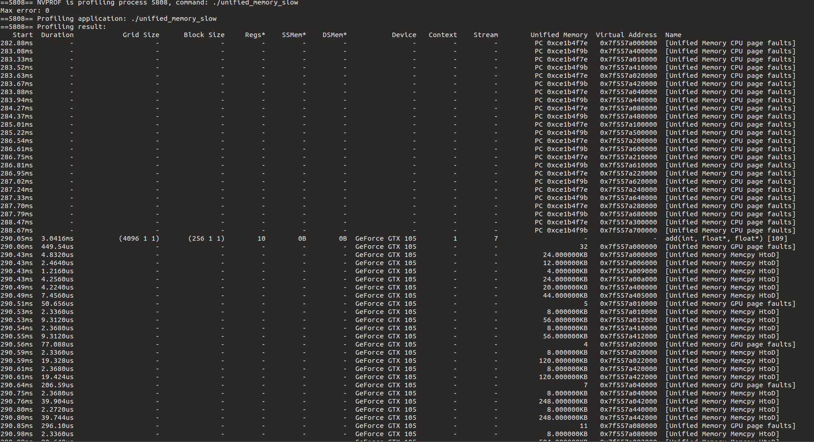
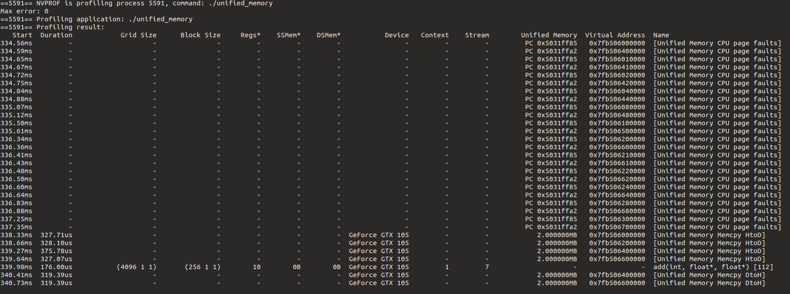
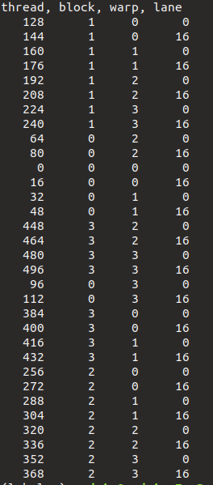
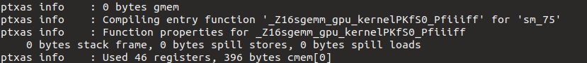
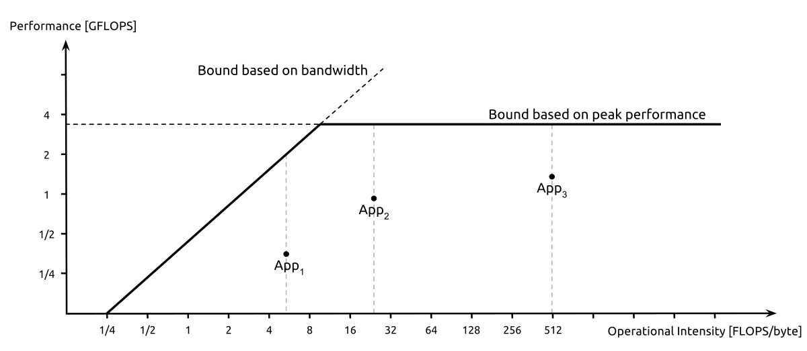

## Cuda Study Repo 

#### Streaming Multiprocessor (SM) 
CUDA GPUs are based on scalable arrays of multithreaded SMs. Each SM consists of several CUDA cores. 
Low clock rate and small cache. One SM can run multiple thread blocks in parallel and has schedulers to issue instructions to warps. It has a large amount of registers to store data from thousands of threads running at the same time. 
All warps of a thread block are on the SM until each one has finished computation. 

#### Blocks
Blocks consist of several threads (up to 1024), they are divided in to warps. These warps are assigned to SMs for execution. The scheduling is very architecture (Volta, Kepler, Turing,...) specific. 

#### Grids
Several blocks can be used to form a grid, all the blocks inside a grid have the same number of threads. Grids can be used for computations that require a large amount of parallely running thread blocks. 

#### Warps
Basic CUDA execution unit. A warp consists of 32 threads, threads inside a warp can be assumed to execute in lockstep. In order to synch different warps, we can use : 
```C++
__syncthreads(); 
```
#### Access Patterns
Coalesced global memory access is desired to avoid cache misses and use cache lines effeciently. 
Structures of Arrays (SOA) is preferred for SIMT models like CUDA, while CPUs perefer sequential AOS for cache efficiency.

#### Shared Memory 
Is user managed cache, used to read from global memory and store it in a coalesced way. Only visible to threads within the same block. It has similiar benefits to CPU cache, but unlike CPU cache it can be user managed. Shared memory has lower latency than global memory and higher bandwith than global memory. 

#### Banks
For higher bandwith, shared memory is organized in banks. Each bank can service one address per cycle, that means that multiple accesses by threads in the same warp to a bank results in a so called bank conflict. The worst case is a 32-way conflict with 31 replays, each replay adds a few cycles of latency. 

#### Read-only data/cache (or texture cache/memory) 
A read-only cache is suitable for storing data that is read-only and does not change the course of kernel execution. It is optimized for this and therefore reduces load on the other caches. It's data is visible to all threads in a grid. The memory is read-only for GPU, however CPU can read and write from it. Objects marked 
```C++
const __restrict__
```
are read only. Loading through this cache can be forced with :
```C++
__ldg
```
Best used when one warp reads from same address/data (broadcast of all of the threads). Otpimized for 2D/3D locality. Optimal for Image Processing for example, supports bilinear/trilinear interpolation. 

#### Registers 

GPUs have lots of registers compared to CPU, this reduces the latency of context switching. Every thread can access only it's own regsisters, local variables declared inside the scope are stored inside the registers. The compiler finds the best # of registers per thread during compilation. 

#### Register Spills 
 
Happens when too many registers are declared and therefore data is moved to L1/L2 cache or even global memory. To avoid this the programmmer should make sure to limit the number of local variables that are declared. This can be done by splitting one complex kernel in a few simpler ones. 

#### Pinned memory 

Data moves from host to device memory (PCIE) or device to device memory (NVLink). In order to avoid getting chocked on the bus, it is recommended to : 

1) minimize the amount of data that is transfered, might even mean to run code on GPU sequentially in order to avoid extra transfer
2) higher banwith through pinned memory 
3) batch small transfers into one large transfer, reduces transfer data CUDA API latency. (ranges from µs to ms, based on System Config)
4) Asynchronous transfer to overlap execution with data transfers. 

#### Pinned vs pageable memory 

GPU will not access pageable memory, CUDA driver copies data from pageable into pinned memory, transfers to device via DMA (Device Memory Controller) => extra latency 
=> has a chance to move requested page to GPU memory, which has been swapped and brought back to GPU. 

```C++
cudaMallocHost(); 
``` 
=> makes memory pinned 
 
Pinned memory bandwith is higher for low data sizes, pageable bandwith is higher with large data sizes. (Due to techniques such as overlap that are used by the DMA engine)
Allocating the whole mem as pinned, can reduce overall system performance as it takes away pages for other tasks. There is no right formula for the amount of pinned memory that should be applied, it is depending on the system heavily.  

#### Unified memory  

Accessible by all CPUs and GPUs on the node. Should be accessed in a coalesced way.  Uses ```cudaMallocManaged()``` instead of ```malloc()```
The variables only need to be declared once, unlike what we previously saw => simpler for programmers. 
```cudaMallocManaged()``` delcares memory on a first touch basis, so if the mem is first allocated on CPU, the page will be mapped to the CPU. So if we acces it from GPU, there will be a page fault and the time will of page migration will be additionall overhead that occurs in this case. 


#### Page migration 

1) allocate new pages on GPU and CPU (first touch basis, see previous section). If it is not present, a page table fault happens. 
2) Old page is unmapped 
3) data is copied from CPU to GPU 
4) new pages are mapped on the GPU, old pages are freed on the CPU 

#### Translation Lookaside Buffer (TLB)

Like in CPU, maps physical to virtual address. TLB is locked when TLB occurs, new instructions will be stalled, until preceding steps were performed. => necessary to maintain coherency and maintain memory state in the SM. Responsible for removing duplicates, updating the mapping and transferring the page data. All of this time is added to the kernel time. 

How to solve this ? : 
1) create init kernel on GPU, so that there are no page faults, then optimize the page faults by using the warp per page control concept
2) prefetch the data 

#### Optimizing unified memory with warp per page control idea 

Adding a kernel to init the array in the GPU itself => pages are allocated and mapped to the GPU memory (first touch).
=> we can see that unified_initialzed.cu (Chapter02/ Folder 4) performs orders of magnitude better on bandwith than the naive version. 

No host to device row now, however init takes the longest now . To see indiviudal page faults we can use : 
```sh 
nvprof --print-gpu-trace
``` 

In the unified_initialzed.cu case, 11 page faults occur. When access is complicated, the driver does not have enough information about to migrate to GPU. Therefore warp per page is used. 


#### Warp per Page 

Means that each warp will access memory that is in the same page : 
```C++
#define STRIDE_64K 65536

__global__ void init(int n, float *x, float *y) {
    int lane_id = threadIdx.x & 31; //31 because one warp consists of 32 threads 
    size_t warp_id = (threadIdx.x + blockIdx.x * blockDim.x) >> 5; 
    size_t warps_per_grid = (blockDim.x * gridDim.x) >> 5; 
    size_t warp_total = ((sizeof(float)*n) + STRIDE_64K-1)/STRIDE_64K; 
    for(;warp_id < warp_total;warp_id += warps_per_grid)
    {
        //pragma unroll
        for(int rep = 0; rep < STRIDE_64K/sizeof(float)/32; ++rep) {
            size_t ind = warp_id * STRIDE_64K/sizeof(float)/32 + rep * 32 + lane_id; 
            if(ind < n) {
                x[ind] = 1.0f; 
                y[ind] = 2.0f; 
            }
        }
    } 
}
```
Each warp manages 64 KB. (warp 1 the first 64 KB, warp 2 the next 64 KB, ...) 
This leads to each warp only accessing memory within the same pages. This is necessary as the driver can not always determine wheter data can be sent to the GPU, especially when the access pattern is more complicated. Above each thread in a warp loops to populate the index  within the  same 64KB. This reduces both init time and GPU fault group. 

#### Data prefetching 

Hints to the driver to prefetch data that might be used next, the API is called 
```C++
cudaMemPrefetchAsync(); 
``` 

if we know what memory will be used on which device, we can prefetch it. 
With unified memory, the limited GPU memory can be extended. 
You can get higher performance with unified memory, with prefetching and hints where data is located (cudaMemAdvice()) can help in multi processor cases a lot. 

Use the following for profiling the code : 

```sh
nvprof --print-gpu-trace
```

Using prefetching and the warp per page conept we can see the clear advantages with our optimized code when profiling : 

Standard version (not full output as there are many Page faults):  



Optimized version : 


 

## CUDA Thread Programming

One SM can execute thread blocks arbitraliy depending on ressources that can be afforded. Also the number of thread blocks executed in parallel depends ont eh ressource available. The number of SMS is obviously a Hardware limit, e.g. a Tesla V100 has 80 and a 2080 TI has 48. 

Cuda threads are grouped in warps (32 threads). It is the basic control unit in CUDA and the optimal thread block size is determined by fully utilizing the blocks warp scheduling. Cuda threads in a warp run in parallel and have synchronous operations inherently. The area is called warp-level primitive programming.  


Looking at the output of : cuda_thread_block.cu (with block size of 4 and tread block size of 128) and we can see the following : 



We can conclude that CUDA threads are launched in warp size and the order is not determined :   

=> out of order block execution : thread blocks are not run in order   (2nd column) 
=> out of order warp index with a thread block : warp's orders varies across blocks. Therefore    there is no guarantee of warp execution order (3rd column)
=> grouped threads executed in a warp (last column), only two indices are printed to limit the output      

Summary : CUda threads are grouped into 32 threads, output of them and warp's exectuion order is out of order. Programmers have to be aware of this 


### Cuda Occupancy 

Is the ratio of active CUDA warps to the maximum warps that each SM can execute concurrently. Higher occupancy means more efficiency in genernal, but it can decrease performance due to high ressource usage between the threads. Therefore the programmer needs to make sure that warp instructions are issued efficiently. Scheduling multiple warps efficiently can hide latencies such as from memory or instructions. Occupancy can be determined theoretically or practically using a profiler such as nsight commpute which is recommended for Turing and probably Ampere when it is released. 
Theoretical occupancy can be seen as the maximum upper bound as it does not consider memory/instruction latencies. 

Compile with : 
```sh 
nvcc -m 64 --resource-usage -gencode arch=compute_75,code=sm_75 -I/usr/local/cuda/samples/common/inc -o sgemm ./sgemm.cu
```

when using Linux and a Turing architecture chip (75). 

This show us this, which is the number of registers per thread and constant memory usage : 





Also an excel tool can be used which is in /usr/local/cuda/tools in Linux for theoretical analysis. Note that in practice 100% occupancy can not be achieved in practice. 

### Bounding register usage 

When the kernel is complicated or double precision is used, register use can increase and so does occupancy. In order to usage tune the GPU ```__launch_bound__``` : 
```C++ 
int maxThreadperBlock=256; 
int minBlocksPerSM = 2; 
__global__ void __launch_bound__(maxThreadperBlock,minBlocksPerSM) foo_kernel() [
]
```

can be used as a qualifier for the kernel function. This will let nvcc guarantee a minimum size of thread blocks per SM with the max block size. NVCC will find the optimial configuaration to guarantee this. It then checks the upper-bound ressources and reduces the limiting resource usage per block. If this bound is not reached the compiler can adjust the register usage and schedule an extra thread block per SM, if the second parameter is not given. Alternatively it can increase register usage to hide single-thread latency. We can also limit the # of occupied registers woth --maxrregcount during compilation. 

SMs can stall and can not conceal memory access latency due to hampered memory requests. 

Achieved occupancy from the compiler :   
 
Can be optained using the Visual Profiler. : Page 99 in the book for detailed explanations 

It can be used for occupancy tuning in order to fully utilize warp scheduling. However memory throttling issues can not be fixed thru this. 
We can again conclude that SMs can stall and can not conceal memory access latency due to hampered memory requests. This can be optimized by using Parallel Programming Patterns. 


### Parallel Reduction 

Parallel way can reduce number of steps, approaches : 

1) naive with global memory
2) reduce kernels with shared memory : 
reduces global memory bandwith and therefore latency 

### Performance Measure 

CUDA sample timer helper function is used 

```C++
StopWatchInterface *timer; 
sdkCreateTimer(&timer); 
sdkStartTimer(&timer);

//Code is executed 

//Getting elapsed time 
cudaDeviceSynchronize(); //blocks host until GPU is done 
work 
sdkStopTimer(); 
//get execution time in µs 
float exe_time = sdkGetTimerValue(&timer); 

//Terminate the timer 
sdkDeleteTimer(&timer);
```


### Identify the Performance Bottleneck 

4 types of limiters exist : 

- Compute Bound 
- Latency Bound
- Bandwith Bound 
- Compute and latency bound 

Strategy : 
If one ressource is the limiter, we focus on that one. If both are under-used, we can apply latency optmization for I/O of the system. If both are high, we need to see if there is a memory or compute related issue. 

In order to determine this nvprof is used, the analysis view is a good way of getting the necessary information .  

NVPROF performance device access issue quick fix : [here](https://forums.developer.nvidia.com/t/err-nvgpuctrperm-the-user-does-not-have-permission-to-profile-on-the-target-device/76285/4) 

We can see that global is heavily memory bound as we predicted, however normal shared is very compute bound. Therefore shared is changed from : 

```C++
__global__ void reduction_kernel(float *d_out, float *d_in , unsigned int size) {
        unsigned int idx_x = blockDim.x * blockIdx.x + threadIdx.x;

        extern __shared__ float s_data[];

        s_data[threadIdx.x] = (idx_x < size) ? d_in[idx_x] : 0.0;

        __syncthreads();

      for(unsigned int stride = 1; stride < blockDim.x; stride *= 2) 
 {
        // thread synchronous reduction
        if ( (idx_x % (stride * 2)) == 0 )
            s_data[threadIdx.x] += s_data[threadIdx.x + stride];
 }
  __syncthreads();
        if (threadIdx.x == 0)
           d_out[blockIdx.x] = s_data[0];
} 
 
```
which is heavy due to the modulo operator. As stride is an exponential of 2, it is replaced with a lightweight bitwise operator as follows : 

```C++
__global__ void reduction_kernel(float *d_out, float *d_in , unsigned int size) {
        unsigned int idx_x = blockDim.x * blockIdx.x + threadIdx.x;

        extern __shared__ float s_data[];

        s_data[threadIdx.x] = (idx_x < size) ? d_in[idx_x] : 0.0;

        __syncthreads();

 for(unsigned int s = 1; s < blockDim.x; s *= 2)
        {
                if((idx_x & (s * 2 -1))==0)
                         s_data[threadIdx.x] += s_data[threadIdx.x + s];
        }
         __syncthreads();
        if (threadIdx.x == 0)
           d_out[blockIdx.x] = s_data[0];
} 
```

This kernel is both compute and latency bound, so we can say that we can increase memory usage by optimizing compute efficiency. 

### Minimizing the warp divergence effect 

In SIMT, if a branch isi encountered branch divergence can occur. This needs to minimized by : 

- avoid by hanlding different warps to execute branch 
- coalescing the branch to reduce branches in a warp 
- shorten the branch, so less occur 
- rearrang the data to improve the access pattern 
- partition the data into groups using tiled_operation in Cooperative Group 

In our last example the divergence is about 73%, reduction addressing is the issue here : 

```C+
     if((idx_x & (s * 2 -1))==0)
```

This addressing can be done with : 

- inteleaved or 
- sequential addressing


Interleaved : 
large strided values are used, it is slower than the previous approach as each block is not fully utilized. 

Sequential : 
Coalesced indexing and addressing, leads to faster execution time. Thanks to avoidance of warp divergence we are also about 12x faster than the original approach.  
Control flow is reduced and memory is utilized more. 


### Roofline model 

Is used to determine what we should be bounded to. If an implementation does not meet this model, we can say that it is latency bound.
Looking at the profiler, we can see that ememory bandwith is not used perfectly, which should be improved next.   


### Grid strided loops

To achieve this grid-strided loops are used. It accumulates data first and then reduces it. 
In order to choose the grid size, we use : 
``` C++ 
cudaOccupancyMaxActiveBlocksPerMultiprocessor()
```
API, that way we can use all multiprocessors in our GPU. 


