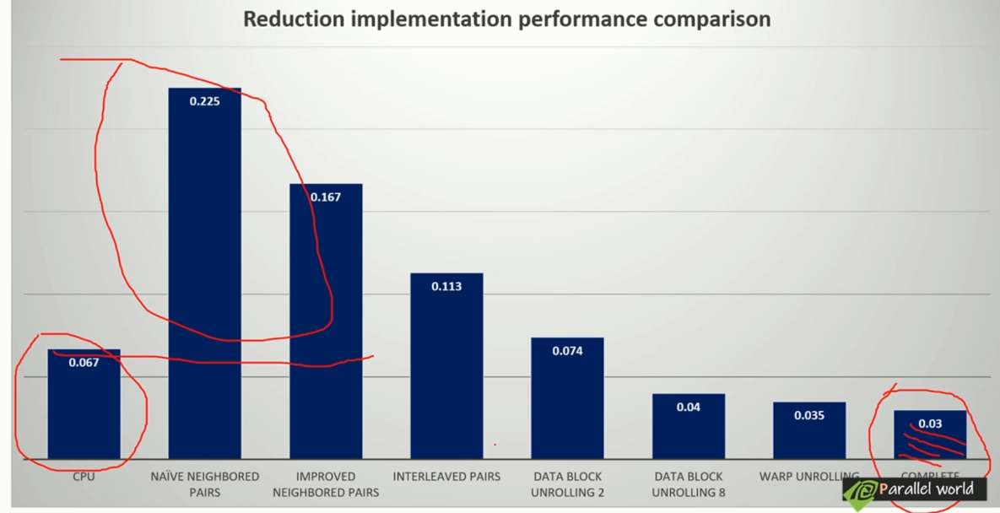
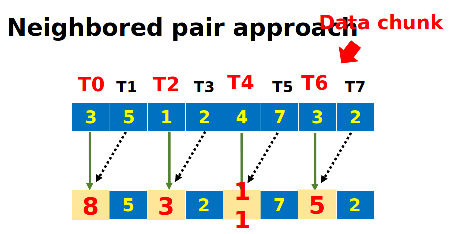
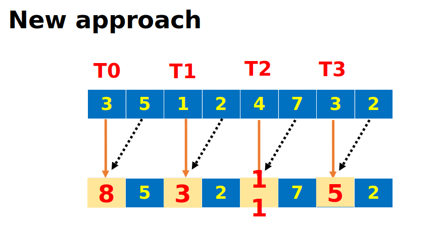
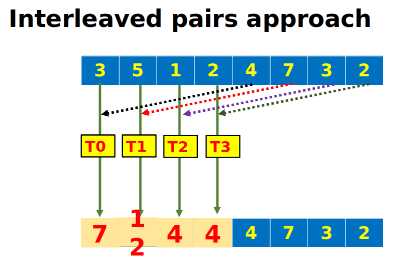
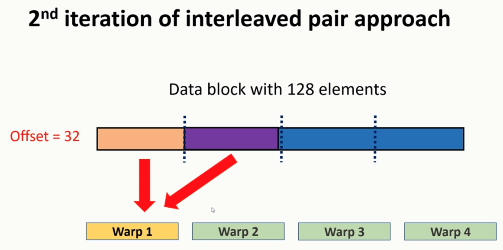
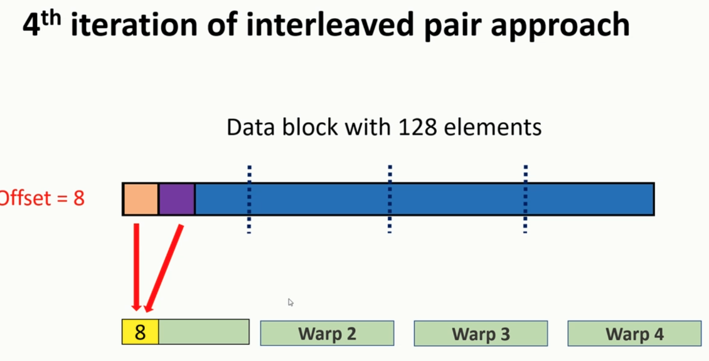
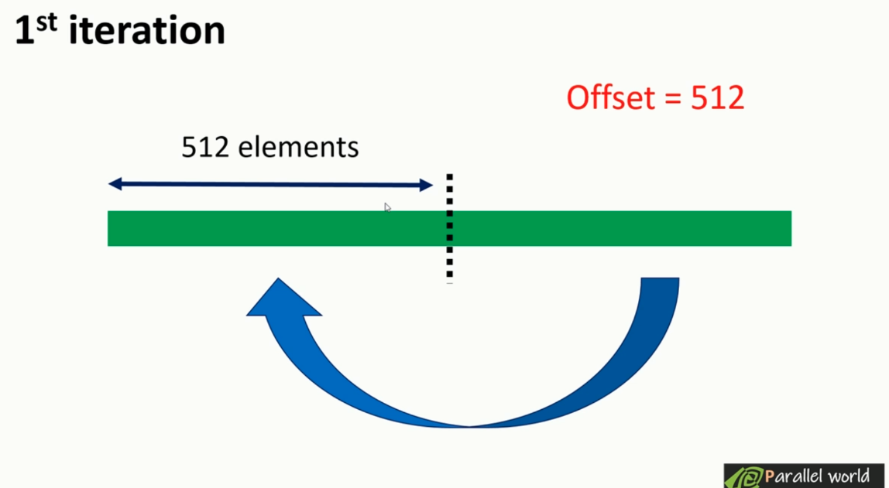
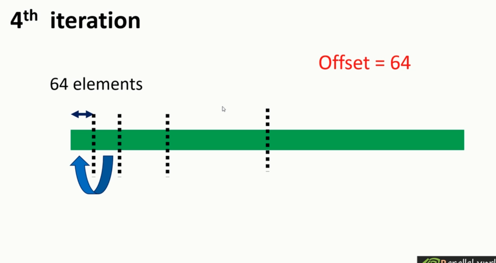

## Chapter 2 Performance Comparison 



## Nvprof
The nvprof profiling tool enables you to collect and view profiling data from the command-line : 
- kernel executions.
- memory transfers. 
- CUDA API calls 
- events or metrics for CUDA kernels.

## usage : nvprof --events/--metric
### metrics : 
- sm_efficiency
- Achieved_occupancy 
- Branch_efficiency
- Gld_efficiency
- Gld_throuput
- Dram_read_throughput
- Inst_per_warp
- Stall_sync

## Parallel Reduction Algos
### Naive Neighborhood pairs approach => Warp divergence 

Code : 
```C
for(int offset =1 ; offset < blockdim.x; offset *=2)
{
	if(  tid % (2* offset)==0  )
	{
		input[ tid ] += input[ tid + offset ];
	}
	__syncthreads()
}
```
### Force neighboring threads to perform summation

Code : 
```C
int * i_data = int_array +  blockDim.x * blockIdx.x;

for (int offset = 1; offset < blockDim.x; offset *= 2)
{
	int index = 2 * offset * tid;
	
	if (index < blockDim.x)
	{
		i_data[index] += i_data[index + offset];
	}
	__syncthreads();
}
```
### Interleaved Pair 1 

Code : 
```C
__global__ void interleaved_pairs_unroll_loop(int * input,  //has warp divergence only in last iteration
	int * temp, int size) 
{
	int tid = threadIdx.x;

    int offset = blockDim.x * blockIdx.x *2; 
    int index = offset + tid; 
    int *i_data = input + offset; //global memory
    if((index + blockDim.x)<size)
    {
        input[index] += input[index + blockDim.x]; 
    }
    __syncthreads(); 
	
	for (int offset = blockDim.x/2; offset >= 0; offset /= 2)
	{
        if(tid < offset)
        {
            i_data[tid] += i_data[tid + offset]; 
        } 

		__syncthreads();
	}

	if (tid == 0) //only thread 0 can write 
	{
		temp[blockIdx.x] = i_data[0]; 
    }
}
//dim3 grid((size/block_size)+2); //interleaved_pairs_unroll_loop
```

### Warp unrolling, using warps to eliminate warp divergence 

#### this next step will be performed unrolled : (tid<32)


Code : 
```C
__global__ void interleaved_pairs_unroll_warp(int * input,  
	int * temp, int size) 
{
	int tid = threadIdx.x;

    int offset = blockDim.x * blockIdx.x; 
    int *i_data = input + offset; 
    
	
	for (int offset = blockDim.x/2; offset >= 64; offset /= 2)
	{
        if(tid < offset)
        {
            i_data[tid] += i_data[tid + offset]; 
        } 

		__syncthreads();
    }
    
    if(tid<32)
    {
        volatile int *vsmem = i_data; //no cache is used
        vsmem[tid] += vsmem[tid + 32];
        vsmem[tid] += vsmem[tid + 16];
        vsmem[tid] += vsmem[tid + 8];
        vsmem[tid] += vsmem[tid + 4];
        vsmem[tid] += vsmem[tid + 2];
        vsmem[tid] += vsmem[tid + 1];
    }

	if (tid == 0) //only thread 0 can write 
	{
		temp[blockIdx.x] = i_data[0]; 
    }
}
```

### Completely unrolling



=> After that we continue unrolled     
Code : 
```C
__global__ void complete_unroll(int * input,  //has warp divergence only in last iteration
	int * temp, int size) 
{
	int tid = threadIdx.x;

    int offset = blockDim.x * blockIdx.x; 
    int *i_data = input + offset; 
    if(blockDim.x == 1024 && tid <512)
    {
        i_data[tid] += i_data[tid + 512]; 
    }
    __syncthreads(); 
	
	if(blockDim.x == 512 && tid <256)
    {
        i_data[tid] += i_data[tid + 256]; 
    }
    __syncthreads();
    if(blockDim.x == 256 && tid <128)
    {
        i_data[tid] += i_data[tid + 128]; 
    }
    __syncthreads();
    if(blockDim.x == 128 && tid <64)
    {
        i_data[tid] += i_data[tid + 64]; 
    }
    __syncthreads();
    if(tid<32)
    {
        volatile int *vsmem = i_data; //no cache is used
        vsmem[tid] += vsmem[tid + 32];
        vsmem[tid] += vsmem[tid + 16];
        vsmem[tid] += vsmem[tid + 8];
        vsmem[tid] += vsmem[tid + 4];
        vsmem[tid] += vsmem[tid + 2];
        vsmem[tid] += vsmem[tid + 1];
    }

	if (tid == 0) //only thread 0 can write 
	{
		temp[blockIdx.x] = i_data[0]; 
    }
}
```

### Template functions 
Code : 
```C
template<unsigned int iblock_size>
__global__ void reduction_kernel_complete_template(int * input, 
	int * temp, int size)
{
	int tid = threadIdx.x;
	int index = blockDim.x * blockIdx.x * 8 + threadIdx.x;

	int * i_data = input + blockDim.x * blockIdx.x * 8;
	
	//unrolling blocks
	if ((index + 7 * blockDim.x) < size)
	{
		int a1 = input[index];
		int a2 = input[index + blockDim.x];
		int a3 = input[index + 2 * blockDim.x];
		int a4 = input[index + 3 * blockDim.x];
		int a5 = input[index + 4 * blockDim.x];
		int a6 = input[index + 5 * blockDim.x];
		int a7 = input[index + 6 * blockDim.x];
		int a8 = input[index + 7 * blockDim.x];

		input[index] = a1 + a2 + a3 + a4 + a5 + a6 + a7 + a8;
	}

	__syncthreads();

	//manual unrolling depending on block size
	if (iblock_size >= 1024 && tid < 512)
		i_data[tid] += i_data[tid + 512];

	__syncthreads();

	if (iblock_size >= 512 && tid < 256)
		i_data[tid] += i_data[tid + 256];

	__syncthreads();

	if (iblock_size >= 256 && tid < 128)
		i_data[tid] += i_data[tid + 128];

	__syncthreads();

	if (iblock_size >= 128 && tid < 64)
		i_data[tid] += i_data[tid + 64];

	__syncthreads();

	//unrolling warp
	if (tid < 32)
	{
		volatile int * vsmem = i_data;
		vsmem[tid] += vsmem[tid + 32];
		vsmem[tid] += vsmem[tid + 16];
		vsmem[tid] += vsmem[tid + 8];
		vsmem[tid] += vsmem[tid + 4];
		vsmem[tid] += vsmem[tid + 2];
		vsmem[tid] += vsmem[tid + 1];
	}

	if (tid == 0)
	{
		temp[blockIdx.x] = i_data[0];
	}
}
```
### also dynamic parallelism => problems due to number of new launches 
Code:
``` C
	unsigned int isize)
{
	int tid = threadIdx.x;

	int *idata = g_idata + blockIdx.x*blockDim.x;
	int *odata = &g_odata[blockIdx.x];

	// stop condition   
	if (isize == 2 && tid == 0)
	{
		g_odata[blockIdx.x] = idata[0] + idata[1];
		return;
	}

	// nested invocation   
	int istride = isize >> 1;
	if (istride > 1 && tid < istride)
	{
		// in place reduction    
		idata[tid] += idata[tid + istride];
	}

	// sync at block level   
	__syncthreads();

	// nested invocation to generate child grids 
	if (tid == 0)
	{
		gpuRecursiveReduce << <1, istride >> > (idata, odata, istride);
		cudaDeviceSynchronize();
	}

	// sync at block level again 
	__syncthreads();
}
```

