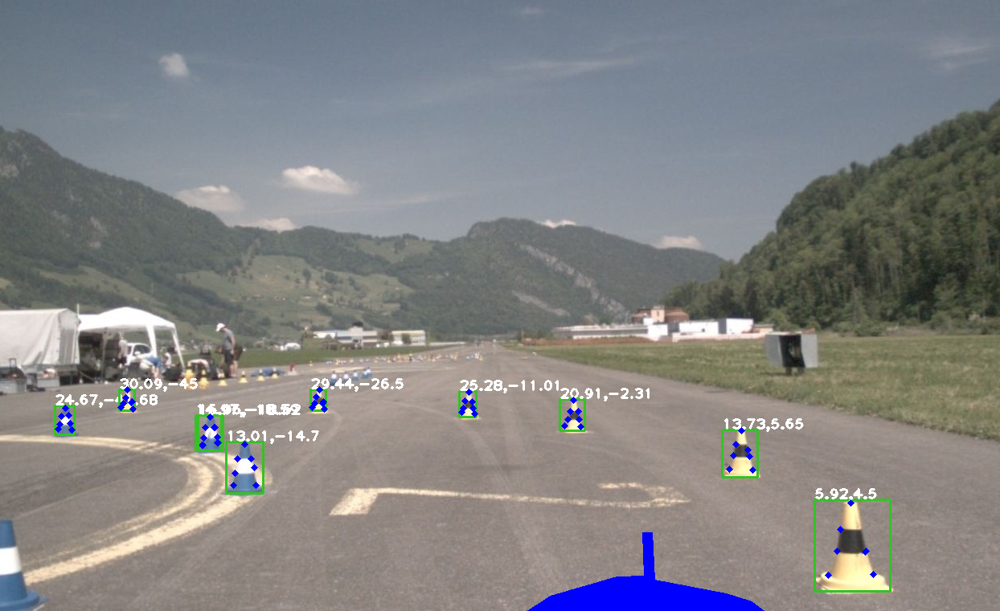
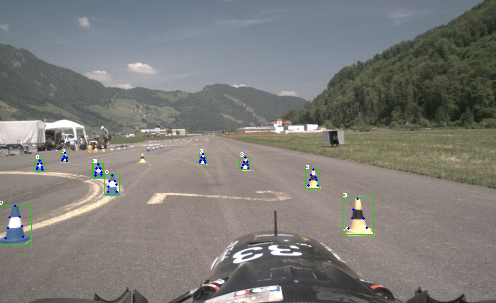

## 2 Stage Detector With Object Detection and Keypoint Extraction in Tensorrt for Formula Student

x,y in 3D coordinates view (Bounding Box classes are not colored) 

Class view (Bounding Box Class is diplayed as the number above the Bounding Box) 

The Pipeline consists of a YOLOv5s network for object detection, trained on the FSOCO Dataset with a refactored version of YOLOv5s which allows for more customization due to better readability. A Keypoint Extractor based on the MIT "RektNet" with a smaller input stem (3x3 instead of 7x7 filter). Thanks to Ultralytics for their implementation of the inofficial "Yolov5" implementation in Python and MIT for providing the Python training code and dataset The Pipeline consists of a [YOLOv5s]() network for object detection and a Keypoint Extractor based on the MIT "RektNet" with a smaller input stem (3x3 instead of 7x7 filter). Thanks to Ultralytics for their implementation of the inofficial "Yolov5" implementation in Python, Wang Xyiu for his Tensorrt implementation for [YOLO](https://github.com/cv-core/MIT-Driverless-CV-TrainingInfra) and [MIT](https://github.com/cv-core/MIT-Driverless-CV-TrainingInfra) for providing the Python training code and dataset of RektNet. The implementation of Rektnet in Tensorrt is done according to the documentation by Nvidia. 
Simple depth estimation is done in Torchscript via triangulation based on the camera/cone parameters and the outpurs of the Keypoint Extractor/Object Detector. 

The Pipeline runs in ~35ms on a Jetson Xavier AGX (no NVDLA engine is used so far, inference in FP16 for both the object detection and keypoint extraction ConvNet).
Further improvements in runtime could be achieved via int8 inference or parameter pruning.  Additionally the Bounding Boxes of the YOLO output are currently cropped on the CPU. I plan to implement a CUDA kernel in order to allow for even faster runtime. 

